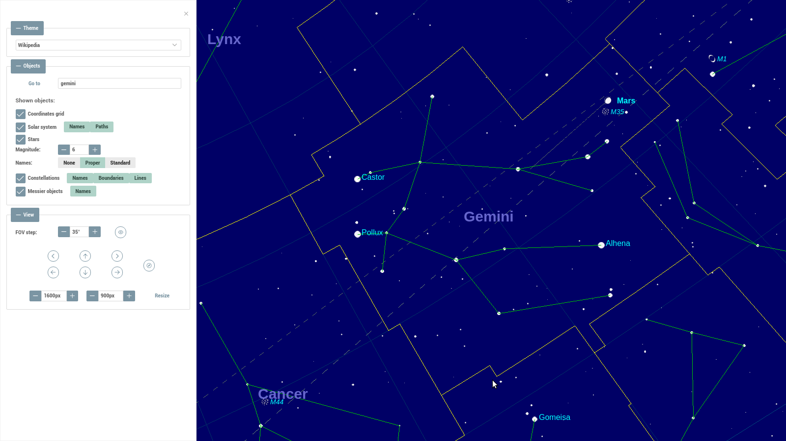
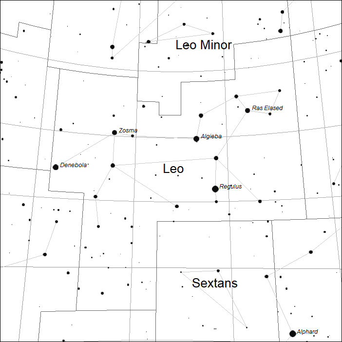
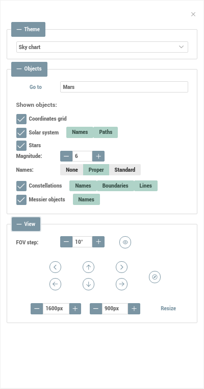

# AstroCadre

_Astronomy sky charts browsing application_


## Description

This application allows to view sky maps using a Web browser:



It provides various possibilities for showing different layers and for easily changing graphical appearance:

 

It is written in Angular/TypeScript and should work in any modern Web browser.

## What is This Thing for?

Currently, the application represents a functional prototype of an interactive sky map, running in a Web browser.

You can navigate in the map by dragging it with the mouse or by using UI controls. You can also toggle layers visibility and adjust the field of view in the viewport.

The application has been designed keeping in mind to make it flexible and provide a possibility for different further usages. For example, we can imagine it to be extended and reused in:

  * graphical rendering of stellar charts (this was the initial purpose of the prototype).
  * applications for educational purposes, in astronomy.
  * queezes and interactive tests.
  * helper UI tool for astronomical catalogues or presentations.
  * any other usage you can imagine it for :)

---

## UI Controls

The main viewport is interactive:
  * dragging with the mouse allows to navigate in all directions of the view.
  * a double click in the view aligns it on the North or South axis to the top, depending on the hemisphere where the view is centered.

The UI controls component provide more features:



All elements of the UI controls have tool tips. All their functionalities can be summarized as follows:

* "GoTo" section: type a constellation code ('and'), name ('andromeda'), star name ('sirius') or sky coordinate in decimal degrees ('185 -60') to center the view on the requested point.

* "Theme" drop-down: selection of graphical theme for the main view.

* "Layers" section: toggle the display of available layers, labels and stars by magnitude. Either proper ('Antares', 'Deneb'...) or standard/Bayer ('Alpha', 'Beta', 'Gamma'...) stellar names can be shown.

* Navigation buttons: 
  * top row: rotate clockwise, go up, rotate counter-clockwise buttons.
  * middle row: go left, down or right buttons.
  * bottom row: change the field of view, actions step in degrees, align with S-N axis buttons.

* Viewport size controls: select the width and the height of the viewport.

---

## Upcoming Features

As of June, 2018, these features have been scheduled for further development:

  * Transform the application into a component that can be easily integrated into a Web page.
  * Extend style/theme configuration options.
  * Make objects selectable in the view.
  * Export the view as raster images.
  * More layers: Solar system objects, Messier objects...

---

## Recommended Environment

### Front-End

[Visual Studio Code](https://code.visualstudio.com/) is recommended.

The following VSC extensions are also recommended:

* EditorConfig for VS Code (v.0.12.4+), uses the `./.editorconfig` file.
* ESLint (v1.4.12+), with default configuration.
* TSLint (v.1.0.30+), uses the `./tsconfig.json`, `./tslint.json` and `./src/tsconfig.*.json` files.

### Back-End & Tools

For the tools/data processing part, any IDE supporting Java+Maven projects may be used. However, [IntelliJ IDEA CE](https://www.jetbrains.com/idea/download) was used for development.

Currently, the application does not have a specific back-end part. All the served resources are static and they are generated using `./tools/data-import` sub-project.

---

## NPM Commands and Tasks

### Pre-Requisites

[NodeJS](https://nodejs.org/en/download/) v5.6.0+ must be installed in order to lauch the application in development mode.

### Commands

The following commands runnable with `npm {command}` or `npm run {command}` are defined in `package.json`:

* `clean`: removes the contents of the current `dist` directory, supposed to contain last production build files.
* `start`: executes a build in _development_ mode and launches the server on `http://localhost:4200`.
* `build:dev`: executes a build in _development_ mode, without starting the server.
* `build:prod`: cleans the current distribution files and executes a build in _production_ mode. The resulting files are placed in the `./dist` folder.
* `test`: executes the unit tests.
* `lint`: executes linting checks.

_Quickstart_: after cloning the source repository, `npm start` command should launch the application at `localhost:4200`.

The commands above should work equally from VSC integrated terminals or from any terminal/CLI tools.

---

## Project Structure

The project is structured as follows:

```text
./
 |- /dist              // distribution files for production deployment
 |- /doc               // additional documentation
 |- /src               // the source code and related files
 |   |- /app           // main and test source code files
 |   |- /assets        // static resources served by the back-end of the app
 |   |- /environments  // environment configuration files
 |   |- /raw           // raw source files for assets, excluded from dist
 |   |- main.ts        // main entry point of the application
 |   |- test.ts        // test entry point of the application
 |- /tools
 |   |- /data-import   // static resources generation utility
 |   |   |- README.md  // documentation for tools
 |- LICENSE            // license file
 |- README.md          // this README file
 |- {other configuration files}
```

`./tools/data-import` contains a Maven project written in Java, allowing to generate static resource JSON files with stellar and other data used in the application. The generated files are placed into `./src/assets` folder and then included into the distribution. For more information about how to generate the static resources and their format, please check the respective `README.md` file in [`./tools/data-import`](./tools/data-import/README.md).

---

## Configuration

The graphic properties of the application can be configured by providing a few JSON files placed in `/src/assets/themes`.

### Themes

Themes allow to switch easily between different sets of graphical representation. For example, the following series of images contain exactly the same view, rendered with various themes.

1. `Sky Chart` theme:


2. `Wikipedia` theme:


3. `Night View` theme:


4. `Tiny` theme:


### Theme Metadata

All available graphic themes are described in `/src/assets/themes/themes.json` file. To add a new theme definition, the following structure should be appended to its `items` array:

```
{
  "code": "theme-code",         // mandatory, should be alphanumeric, without spaces.
  "label": "Theme label",       // optinal, the label to show in the UI controls.
  "description": "description", // optional description shown in the UI controls.
  "selected": false             // optional, only the first 'true' value in the list of items is taken into account.
}
```

To remove an existing theme, simply delete the respective JSON object from `items` list.

### Theme Properties Definition

For each theme item declared in `themes.json`, a corresponding `.json` file must exist in the same folder. The name of the file must be `{code}.json`, where `{code}` is the value used as `"code"` property for the respective theme item in `themes.json`. For example, for the theme metadata definition above, there must be a file named `theme-code.json`.

Themes have the following configurable properties:

```
{
  "code": "string",    // redundant with respective "code" value from themes.json
  "background": {
    // the background color of the viewport
    "color": "string"  // CSS RGB color definition, for example 'rgb(10, 10, 10)'
  },
  // properties of the coordinates grid
  "skyGrid": {
    // coordinate lines
    "line": {
      // most of lines
      "common": "string",   // CSS RGB color definition
      // equator and 0-meridian lines
      "reference": "string" // CSS RGB color definition
    }
  },
  // properties of the constellations
  "constellation": {
    // constellation boundaries (area limits)
    "boundaries": {
      "line": {
        "common": "string"   // CSS RGB color definition
      }
    },
    // lines between stars in a constellation
    "lines": {
      "line": {
        "common": "string"   // CSS RGB color definition
      }
    },
    // constellation name labels
    "names": {
      "fontSize": "string",   // CSS size of the font in pixels, for example "16px"
      "fontFamily": "string", // CSS font-family
      "fontStyle": "string",  // CSS font-style, "italic" or "normal"
      "fontWeight": "string", // CSS font-weight, "bold" or "normal
      "color": "string"       // CSS RGB color definition, for the font
    }
  },
  // properties of stars
  "stars": {
    // the magnitudes to show, in descending order
    "magnitudes": [ 2, 2.5, 3, 3.5, 4, 4.5, 5, 5.5, 6 ],
    // the texture to use for a point representing a star
    "texture": {
      // path to the image file, relative to /src
      "image": "assets/textures/star.png",
      // multiplication ratio between the min (6) and max (2) magnitudes
      // value of 3 means that max magnitude stars will be shown 3 times bigger than minimal
      "sizeMultiplier": 3
    },
    // star name labels
    "names": {
      // labels for proper names, see constellation.names for details
      "proper": {
        "fontSize": "string",
        "fontFamily": "string",
        "fontStyle": "string",
        "fontWeight": "string",
        "color": "string"
      },
      // labels for standard names, see constellation.names for details
      "standard": {
        "fontSize": "string",
        "fontFamily": "string",
        "fontStyle": "string",
        "fontWeight": "string",
        "color": "string"
      }
    }
  }
}
```

---

## Release History

* The POC development started on April 15th, 2018.

* The sources were made public on Github on June 14th, 2018, with version number 0.18.6.

The detailed project history and notes are available in [follow-up documentation](./doc/follow-up.md).

---

## Version Control and Workflow

The most recent validated version of the project is available on the `master` branch.

Features/user stories/issues are identified with the pattern `AC-{number}`.

When a feature/user story/issue is finished, a tag must be created, named with the respective identifier.

Development branches should be named `dev-AC-{number}`.

---

## License

This software is distributed under MIT license conditions.

Please check more details in `LICENSE` file.

--- 

(c) 2018 Anton Telechev
